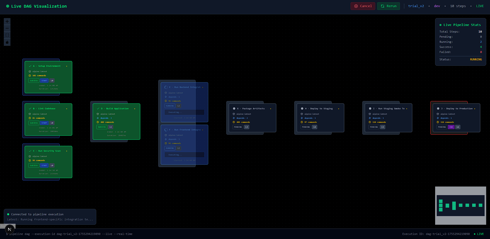
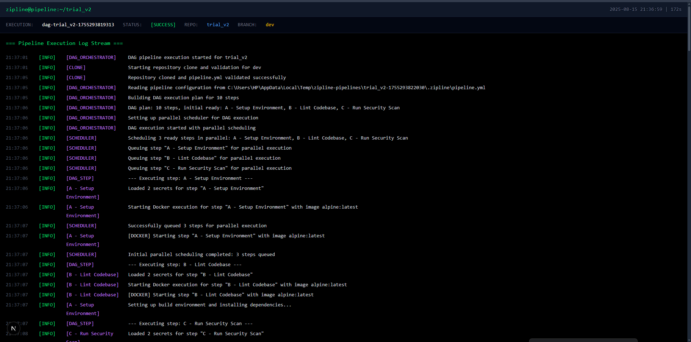
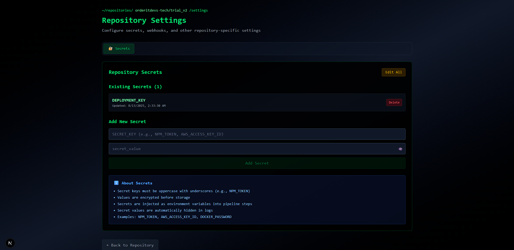

<p align="center">
  
</p>

<h1 align="center">Zipline: A High-Performance CI/CD Orchestration Engine</h1>

<p align="center">
  
  
  
</p>

<p align="center">
  Zipline is a backend-centric, event-driven CI/CD platform engineered to orchestrate complex, parallel build workflows. Built from the ground up with Node.js and TypeScript, it demonstrates advanced system design principles by parsing user-defined YAML pipelines, executing steps in isolated Docker containers, and providing real-time feedback through a dynamic web interface.
</p>

<p align="center">
  <strong><a href="https://drive.google.com/file/d/10YEde9DwH-mu9_c3qmg4k3X5sTnmGgXw/view?usp=sharing">View the Live Demo »</a></strong>
</p>

---

## 🎥 Live Demo

<p align="center">
  <video src="./assets/demo.mp4" controls width="600">
    Your browser does not support the video tag.
  </video>
</p>

*Demo: Live DAG visualization, real-time log streaming, and pipeline status updates in action.*

---

## 📸 Screenshots

**Live DAG Visualization:**


**Real-time Log Output:**


**Artifacts Download Section:**


**Secrets Management UI:**


---

## ✨ Core Features

### Orchestration & Execution
* **DAG Orchestration:** Parses complex `pipeline.yml` files with dependencies (`needs`) and executes them as a Directed Acyclic Graph (DAG), enabling efficient parallel execution of independent steps.
* **Isolated Runtimes:** Every step runs inside a fresh, isolated Docker container, ensuring a clean, secure, and reproducible build environment.
* **Build Artifacts:** Supports saving build artifacts to an S3-compatible object store (MinIO), allowing you to store and retrieve the outputs of your pipelines.
* **Secrets Management:** Securely manages sensitive information like API keys and tokens. Secrets are encrypted at rest and injected into pipeline steps as environment variables, with automatic masking in logs.
* **Dependency Caching:** Accelerates build times by caching dependencies (like `node_modules`) between runs, reducing redundant downloads.
* **Branch-Specific Workflows:** Configure pipelines to run only on specific branches (e.g., `main`, `release/*`), enabling protected deployment workflows.

### Developer Experience
* **Real-time Log Streaming:** Live log output is streamed from the runners directly to the web UI using WebSockets, providing immediate feedback on build progress.
* **Live DAG Visualization:** A dynamic frontend, built with React Flow, visualizes the pipeline's structure and updates the status of each node (queued, running, success, failed) in real-time.
* **Full User Control:** Users can cancel in-progress pipeline runs and re-run completed or failed jobs directly from the UI.
* **GitHub Integration:** Authenticates users via GitHub OAuth and uses webhooks to automatically trigger pipelines on `git push` events.

---

## 🏗️ System Architecture

Zipline is built on a microservices architecture to ensure scalability and separation of concerns. The services communicate asynchronously via a distributed job queue (BullMQ on Redis), creating a resilient, event-driven system.

**[Insert Your Architecture Diagram Here]**
*(A diagram showing the API Gateway, Orchestrator, Runners, Database, Redis, and MinIO would be very effective here.)*

### Key Services

* **API Gateway (Express.js):** The public-facing entry point. It handles user authentication, webhook ingestion, and serves the frontend application.
* **Orchestrator (Node.js):** The brain of the system. It parses pipeline configurations, builds the DAG, and schedules jobs based on dependency resolution.
* **Runner (Node.js):** A pool of workers that execute the actual pipeline steps inside Docker containers.
* **Job Queue (BullMQ on Redis):** The message broker that decouples the services and manages the workload.
* **Database (PostgreSQL with Prisma):** Stores all stateful information, including pipeline run history, step statuses, user data, and encrypted secrets.
* **Object Storage (MinIO):** Stores immutable artifacts like logs, build outputs, and caches.

---

## 🛠️ Tech Stack

| Category      | Technology                                       |
| ------------- | ------------------------------------------------ |
| **Backend** | Node.js, TypeScript, Express.js, BullMQ          |
| **Frontend** | Next.js, React, TypeScript, React Flow           |
| **Database** | PostgreSQL, Prisma (ORM)                         |
| **Real-time** | Socket.io, Redis (Pub/Sub)               |
| **Storage** | MinIO (S3-Compatible Object Storage)             |
| **Infra** | Docker, Docker Compose                           |

---

## 📊 API Endpoints

The backend exposes a comprehensive REST API for managing the entire CI/CD workflow.

| Feature         | Endpoint                               | Method | Description                               |
| --------------- | -------------------------------------- | ------ | ----------------------------------------- |
| **Auth** | `/auth/github`                         | `GET`  | Initiates GitHub OAuth flow.              |
|                 | `/auth/github/callback`                | `GET`  | Handles the OAuth callback.               |
| **Repositories**| `/repositories`                        | `GET`  | Lists user's connected repositories.      |
|                 | `/repositories/setup-webhook`          | `POST` | Enables a repository for Zipline.         |
| **Pipelines** | `/runs/:runId`                         | `GET`  | Gets details for a specific pipeline run. |
|                 | `/runs/:runId/plan`                    | `GET`  | Gets the DAG structure for visualization. |
|                 | `/runs/:runId/cancel`                  | `POST` | Cancels a running pipeline.               |
|                 | `/runs/:runId/rerun`                   | `POST` | Re-runs a completed pipeline.             |
| **Artifacts** | `/artifacts/:runId`                    | `GET`  | Lists artifacts for a pipeline run.       |
|                 | `/artifacts/:artifactId/download`      | `GET`  | Generates a download link for an artifact.|
| **Secrets** | `/secrets/:repo`                       | `GET`  | Lists secret keys for a repository.       |
|                 | `/secrets/:repo`                       | `POST` | Creates or updates a secret.              |
|                 | `/secrets/:repo/:key`                  | `DELETE`| Deletes a secret.                         |
| **Health** | `/health`                              | `GET`  | Health check for the service.             |

---

## 🚀 Getting Started

### Prerequisites

* Node.js (v18+)
* Docker and Docker Compose
* A GitHub account with a configured OAuth App

### Local Development

1.  **Clone the repository:**
    ```bash
    git clone [https://github.com/your-username/zipline.git](https://github.com/your-username/zipline.git)
    cd zipline
    ```

2.  **Configure Environment Variables:**
    Create a `.env` file in your project directory by copying the `.env.example` file. Fill in the required values, including your GitHub OAuth credentials and a webhook secret.

3.  **Install Dependencies:**
    ```bash
    npm install
    ```

4.  **Run the Database Migration:**
    ```bash
    npx prisma migrate dev
    ```

5.  **Start all services:**
    This command will start the backend, database, Redis, and MinIO services.
    ```bash
    docker-compose up -d
    ```

Your application should now be running:
* **Frontend:** `http://localhost:3000`
* **Backend API:** `http://localhost:3001`
* **MinIO Console:** `http://localhost:9001`

---

## 📋 Workflow Execution

1.  A user logs in via GitHub and connects a repository.
2.  Zipline adds a webhook to the repository to listen for `push` events.
3.  When a commit is pushed, GitHub sends a webhook to the Zipline API.
4.  The API validates the request and queues a new pipeline run job.
5.  The Orchestrator picks up the job, clones the repository, parses the `.zipline/pipeline.yml` file, and builds a DAG execution plan.
6.  The Orchestrator schedules all initial, dependency-free jobs and adds them to the queue.
7.  Available Runners pick up the jobs, execute the steps in Docker containers, and stream logs back via WebSockets.
8.  As jobs complete, the Orchestrator evaluates the DAG and queues the next set of dependent jobs until the entire pipeline is finished.
9.  The final status and any artifacts are saved and displayed in the UI.

---

## 🤝 Contributing

Contributions, issues, and feature requests are welcome! Feel free to check the [issues page](https://github.com/your-username/zipline/issues).

---

## 📜 License

This project is [MIT](https://github.com/your-username/zipline/blob/main/LICENSE) licensed.

